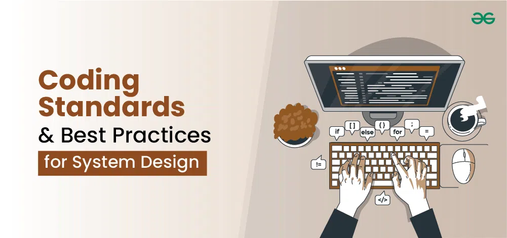

## What is a Coding Standard?

Coding standards are a big part of software engineering because they're like the sentence structure of your code. Beyond just formatting consistency, which is an important aspect for readability, comprehensive coding standards also include:

```

1. Naming Conventions: Clear and consistent naming for variables, functions, classes, and files improves code comprehension.
  Example: sumOfEverything() is better than sOF().

2. Documentation: Standards for inline comments, docstrings, and external documentation ensure maintainability.

3. Performance Considerations: Using best practices for writing more efficient code.

```


## My First Week with ESLint

My first week with ESLint integrated into VSCode was neither terrible nor good. There were so many errors I had to fix regarding spacing and new lines. The sheer volume of errors felt like a barrier to my productivity, demanding constant tiny adjustments and breaking my flow of thought. There were also moments of frustration every time I saw the red underline on my code.

```

function something (G) {
  blah // error (tab space)
}

function something (G) {
  blah // no error (double space)
}

```

This was true for most of my code, and I had to make sure I didn't press the tab key after creating every function. Additionally, there were instances where I couldn't leave trailing spaces, which was annoying.
 
## Conclusion

Overall, coding standards might be hard and annoying to fix at first, but then my code started to look uniform, making it easier to scan and understand what I had written. Additionally, by using best practices, I naturally adopted better patterns; for instance, instead of var, I began using const or let, which is a significant practice in TypeScript.
