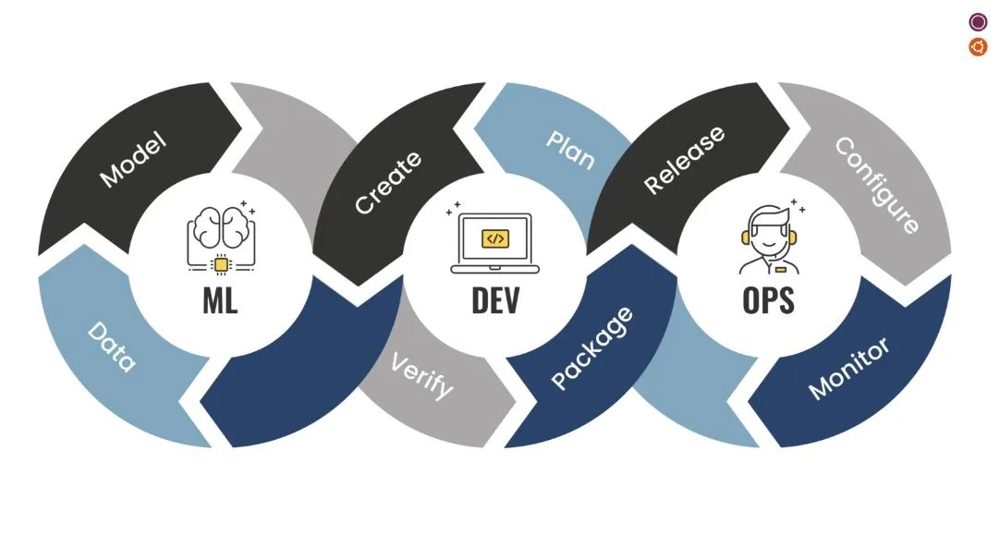

## What Do I Think About Software Engineering?

I always thought software engineering was a career path you had to pursue if you were a computer science major. However, once I got into my degree program, I realized it's quite different. It involves maintaining software and also requires a lot of critical thinking and teamwork, often collaborating with other branches. I've always thought software engineering was something I wanted to do, and taking a class on it now has sparked my interest even more. As someone who's interested in machine learning and artificial intelligence, software engineering is crucial for areas like MLOps or even simpler concepts like DevOps.

## What Kind Of Skills Do I Want To Learn?

A skill I want to learn is primarily backend development. This is because I aspire to become a data scientist, a role that heavily involves utilizing data and creating or implementing algorithms to process that data. What's currently helping me develop these skills are the WODs (Workouts of the Day) that require me to use my critical thinking to structure and implement different functions in my code.

Another skill I aim to acquire is front-end development, specifically using JavaScript or TypeScript. Being knowledgeable in front-end technologies will be incredibly helpful in the future for understanding how the backend and frontend communicate with each other.

Lastly, I want to improve my problem-solving skills, particularly knowing where to begin when approaching a new problem that I want to solve.

## What Experiences Do I Want To Develop In the Future?

In the future, I aim to gain experience leading my own team and tackling complex problems. I want to leverage my software engineering skills to oversee and coordinate various sectors of my projects, providing assistance wherever needed. Furthermore, I'd like to focus on maximizing the development of AI solutions and integrating them effectively within my team's work.
