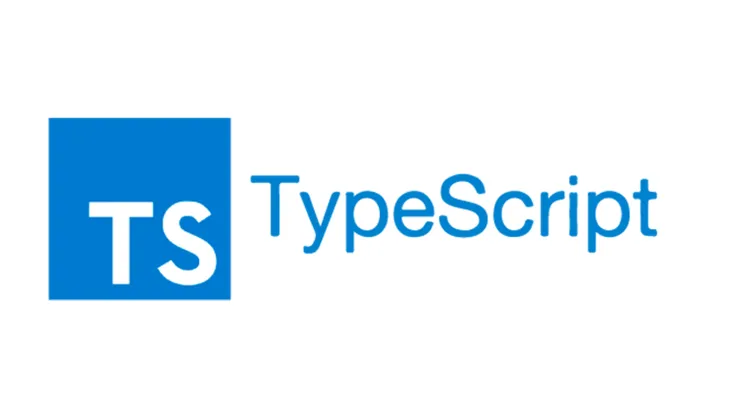

## TypeScript Easy?

After tackling about 150 coding practices in TypeScript, I'm really happy to say I'm getting pretty good at it. It's not just the language itself, but also the actual structure of my code. I took a Java class about two years ago and honestly never touched it again, but working with TypeScript definitely reminded me of Java's syntax and structure. One thing I noticed that was different, though, was the distinction between "let" and "var." I also found myself using "const" variables a lot. It's a big shift from Python, which I was more used to, so it took a little while to get comfortable with the syntax. But overall, it wasn't too bad.


```

let hello = "Hello";

compared to

hello = "Hello"

```


## Is TypeScript a Good Programming Language?

In my opinion, TypeScript is a good programming language, especially from a software engineering perspective. As a beginner, it was much easier to get into than languages like C. Plus, it has types you can set for your objects, which is super convenient and helps prevent errors from popping up.

Two types that I found particularly helpful were "any" and "unknown." They give you flexibility when you need it:


```

let flexVar: any = 10;
flexVar = "anything"; // No error

let unknownVar: unknown = 10;
unknownVar = "anything"; //No error

```

A practice "WOD" (Workout Of the Day) that I found really useful was figuring out if a string is unique. It felt like something you could actually use in a real-life scenario. It's similar to LeetCode-style coding, which is great for tech interviews. This particular exercise also helped me understand code structure better and introduced me to new concepts like Maps.

Here's the code examples from that WOD:

```

function isUnique(str: string): boolean{
    const seenstr: Map<string, boolean> = new Map();
    for (let i = 0; i < str.length; i++){
        const letter = str.charAt(i);
        if (seenstr.get(letter)) {
            return false;
        } 
        else {
            seenstr.set(letter, true);
        }
    }
    return true;
}

console.log(isUnique('abcde')); //true
console.log(isUnique('abcdea')); //false

```
 
## Conclusion

Overall, TypeScript is a language that doesn't take an excessive amount of time to learn, and it's definitely something I want to get really good at. It was an enjoyable and stress-free learning experience. I think continuing with these WODs will greatly help me become a better software engineer, as they really push me to use my critical thinking skills.
