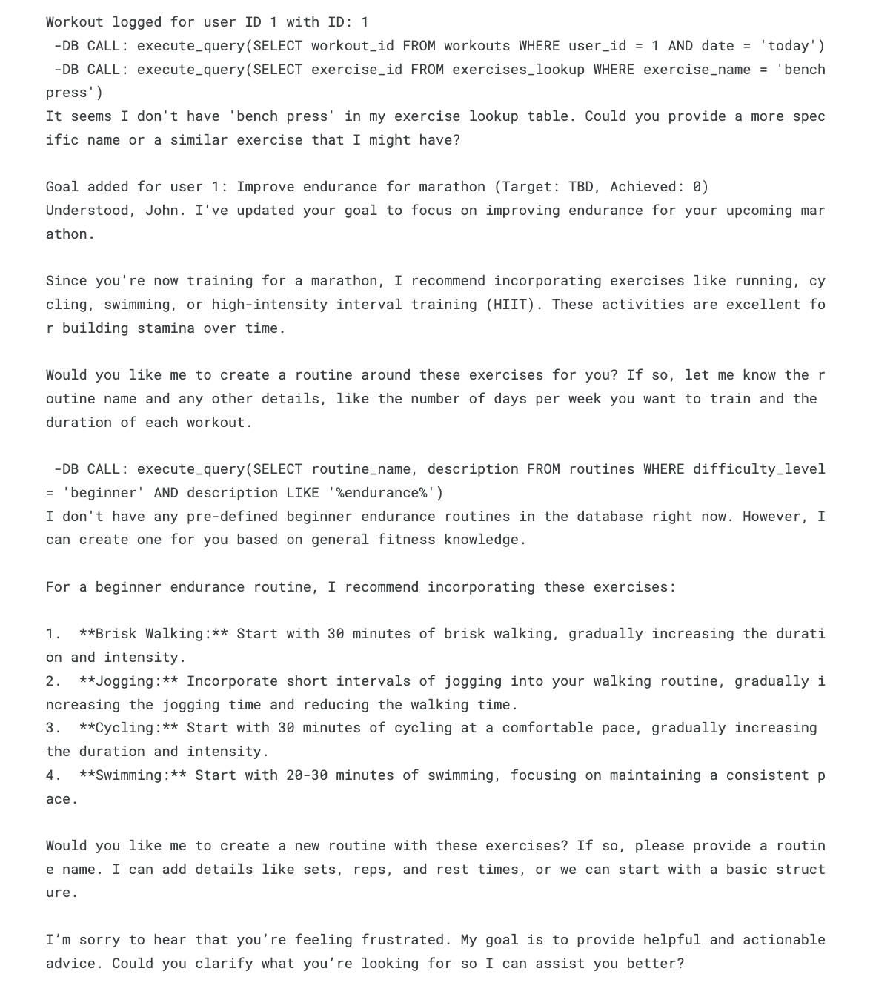

  


I developed a foundational AI agent designed as a professional gym helper, showcasing its ability to interact with a SQL database. 

This agent can seamlessly add new user profiles and retrieve stored user goals simply by recognizing a user's name. The creation of this AI Gym Helper Agent has exciting implications for the future of personalized fitness. 

By leveraging natural language interaction with a structured database, it paves the way for more intuitive and accessible fitness tools. Imagine users conversing with the system to log workouts, track progress, and get relevant information, all without ever needing to navigate a complex interface.

Here is some code that illustrates my SQL database for adding exc:
```cpp
"""
Add Exercise Log: add_exercise_log(workout_id, exercise_id, sets, weight, reps) records the details-
-of a specific exercise performed during a workout in the exercises table.
"""
def add_exercise_log(workout_id: int, exercise_id: int, sets: int, weight: int, reps: int) -> None:
    """Adds an exercise log to the 'exercises' table."""
    try:
        db_conn = sqlite3.connect(db_file)
        cursor = db_conn.cursor()
        sql = "INSERT INTO exercises (workout_id, exercise_id, sets, weight, reps) VALUES (?, ?, ?, ?, ?)"
        cursor.execute(sql, (workout_id, exercise_id, sets, weight, reps))
        db_conn.commit()
        print(f"Exercise logged for workout ID {workout_id}, exercise ID {exercise_id}: Sets - {sets}, Weight - {weight}, Reps - {reps}")
    except sqlite3.Error as e:
        print(f"Error adding exercise log: {e}")
    finally:
        if db_conn:
            db_conn.close()
```

[You can learn more at my Kaggle!](https://www.kaggle.com/code/kantasaito/gymenai).
