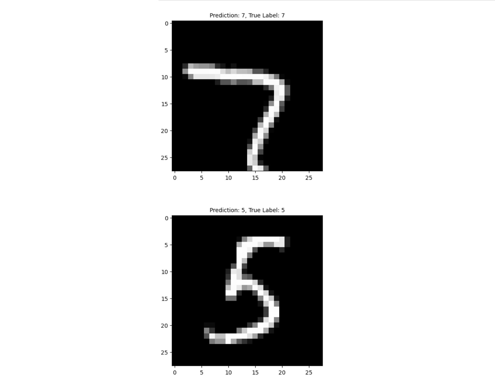

For this project, I embarked on the challenge of constructing a neural network from scratch to predict handwritten digits from the MNIST dataset. 

A pivotal moment in my learning came from grasping the concept of partial derivatives, an essential element for implementing backpropagation. I thoroughly explored the impact of five distinct activation functions: ReLU, Softmax, SeLU, Tanh, and Sigmoid, which proved instrumental in understanding their individual contributions to the network's performance. The DeepLearning.AI machine learning course further enhanced my comprehension of ReLU, Softmax, and Sigmoid. 

Ultimately, this project provided an immensely rewarding experience in unraveling the complexities of neural networks and the nuanced roles of activation functions

Here is some code that illustrates forward propagation and back propagation:

```cpp
def forward_prop(X, W1, b1, W2, b2, W3, b3, W4, b4, W5, b5):
    Z1 = W1.dot(X) + b1 #(32, 784) * (784, m) + (32,1)
    A1 = ReLU(Z1) #(32, m) 
    
    Z2 = W2.dot(A1) + b2 #(32, 32) @ (32, m) + (32, 1)
    A2 = sigmoid(Z2) #(32, m)
    
    Z3 = W3.dot(A2) + b3 #(64, 32) @ (32, m) + (64, 1)
    A3 = SeLU(Z3) #(64, m)
    
    Z4 = W4.dot(A3) + b4 #(64, 64) @ (64, m) + (64, 1)
    A4 = tanh(Z4) #(64, m)
    
    Z5 = W5.dot(A4) + b5 #(10, 64) @ (64, m) + (10, 1)
    A5 = softmax(Z5) #(10, m)
    
    return Z1, A1, Z2, A2, Z3, A3, Z4, A4, Z5, A5

def back_prop(X, Y, W1, W2, W3, W4, W5, Z1, Z2, Z3, Z4, Z5, A1, A2, A3, A4, A5):
    one_hot_Y = one_hot(Y)
    
    dZ5 = A5 - one_hot_Y
    dW5 = 1 / m * dZ5.dot(A4.T)
    db5 = 1 / m * np.sum(dZ5, axis=1, keepdims=True)
    
    dZ4 = W5.T.dot(dZ5) * tanh_deriv(Z4)
    dW4 = 1 / m * dZ4.dot(A3.T)
    db4 = 1 / m * np.sum(dZ4, axis=1, keepdims=True)

    dZ3 = W4.T.dot(dZ4) * SeLU_deriv(Z3)
    dW3 = 1 / m * dZ3.dot(A2.T)
    db3 = 1 / m * np.sum(dZ3, axis=1, keepdims=True)

    dZ2 = W3.T.dot(dZ3) * sigmoid_deriv(Z2)
    dW2 = 1 / m * dZ2.dot(A1.T)
    db2 = 1 / m * np.sum(dZ2, axis=1, keepdims=True)
    
    dZ1 = W2.T.dot(dZ2) * ReLU_deriv(Z1)
    dW1 = 1 / m * dZ1.dot(X.T)
    db1 = 1 / m * np.sum(dZ1, axis=1, keepdims=True)

    return dW1, db1, dW2, db2, dW3, db3, dW4, db4, dW5, db5
```

[You can learn more in my GitHub!](https://github.com/KantaS12/NN_Scratch).
