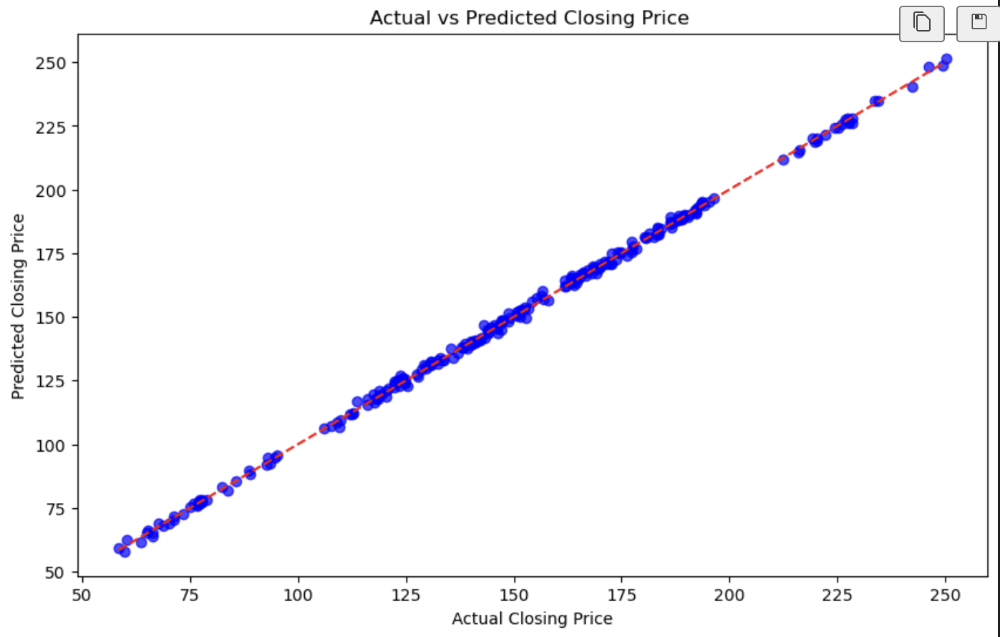

This project explores the fundamental principles behind linear regression implementation, specifically applied to predicting AAPL stock prices sourced from the Yahoo API. A key focus was on optimizing the model's accuracy. I leveraged Principal Component Analysis (PCA) to efficiently reduce the feature space while retaining crucial information. Furthermore, I incorporated gradient descent with regularization—a vital technique for controlling model complexity by minimizing the cost function and effectively managing the delicate balance between bias and variance.

While understanding linear regression is straightforward, achieving high predictive accuracy, especially with real-world data like stock prices, demands meticulous effort and extensive evaluation. This project, though a learning exercise, provided practical experience in mitigating bias and variance. Although comprehensive evaluation could significantly enhance the model, the primary objective was to gain hands-on experience with these advanced techniques using real stock market data.

Here is some code that illustrates gradient descent that uses l1 and l2 regularization:

```cpp
for _ in range(iterations):
    y_pred = x_train_reduced @ w + b
    
    dw = (-2/n) * x_train_reduced.T @ (y_train - y_pred) + lambda_l1 * np.sign(w) + 2 * lambda_l2 * w
    db = (-2/n) * np.sum(y_train - y_pred)
    
    w -= LR * dw
    b -= LR * db
```

You can learn more in my GitHub!(https://github.com/KantaS12/self_regression_model/blob/main/README.md).
